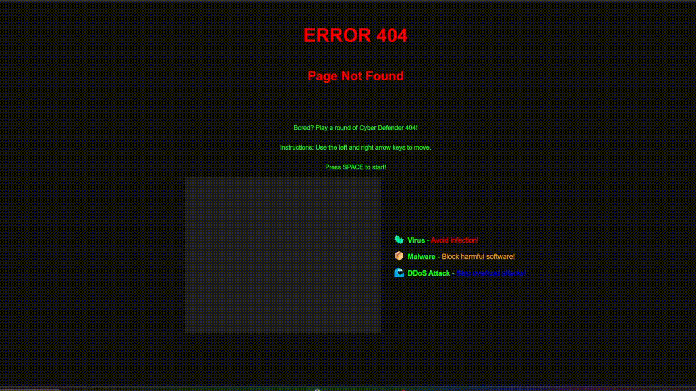
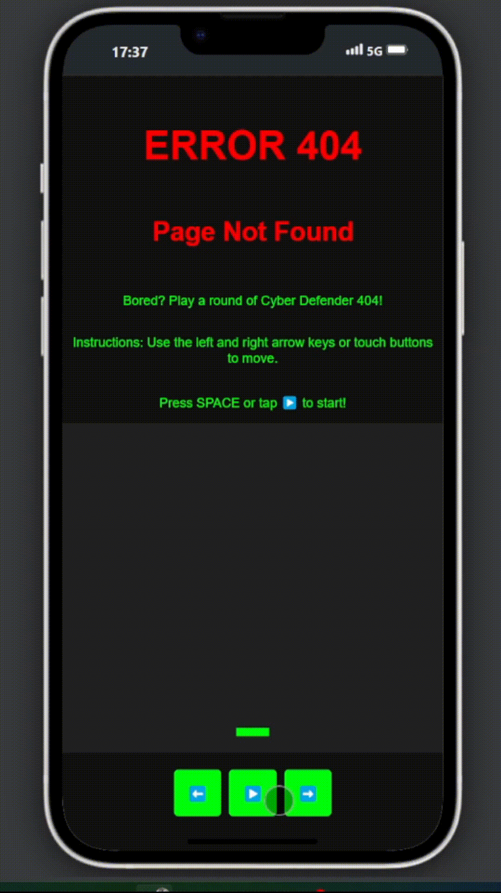

# 404 Cybersecurity Game

🚀 **404 Cybersecurity** is a fun and interactive mini-game designed to raise awareness about cybersecurity. Test your skills, avoid online threats, and learn essential security concepts while playing!

## 🎥 Demo

Check out the gameplay demo below:
🔗 **Try it live:** [404 Cybersecurity Game](https://www.paoloronco.it/404)

### 📱 Mobile Demo

See how the game works on mobile:

## 🌍 Purpose

The primary goal of **404 Cybersecurity** is to serve as a fun and engaging **404 error page** for websites. It works seamlessly on both **PC and mobile devices**.

## 🕹️ How It Works

- **PC Controls:**
  - Start the game by pressing **Space**.
  - Move using the **Arrow Keys** (⬅ ➡).

- **Mobile Controls:**
  - On-screen buttons for **Play** and **Left/Right** movement.

Enhance your 404 pages with a cybersecurity-themed mini-game and keep visitors entertained while they learn! 🚀🔒
